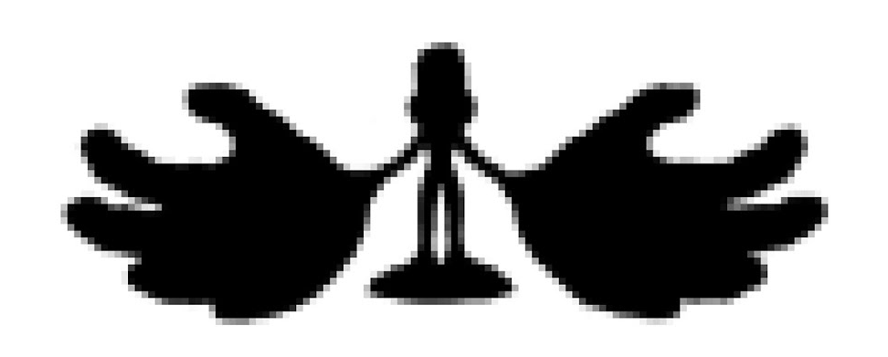

# Project Homunculus

## Repository layout

| Path | Description |
|------|-------------|
| [`glove/`](glove/) | **Hall Effect VR Glove** — firmware, 3D-printable enclosure, PCB design, Unity hand visualizer, and experimental tools. |
| [`exo/`](exo/) | **Exoskeleton Arm** *(submodule)* — 7-DOF whole-body control device with CAD, firmware, URDF models, and PCB files. |