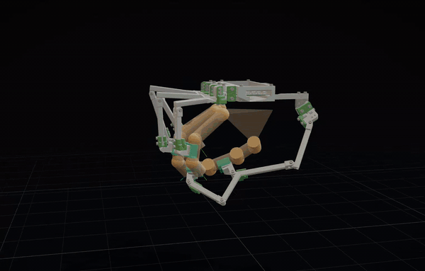
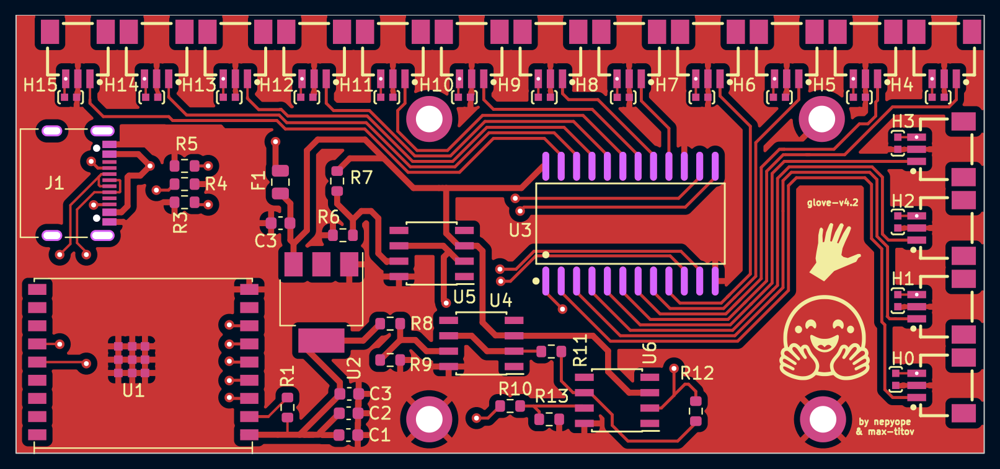
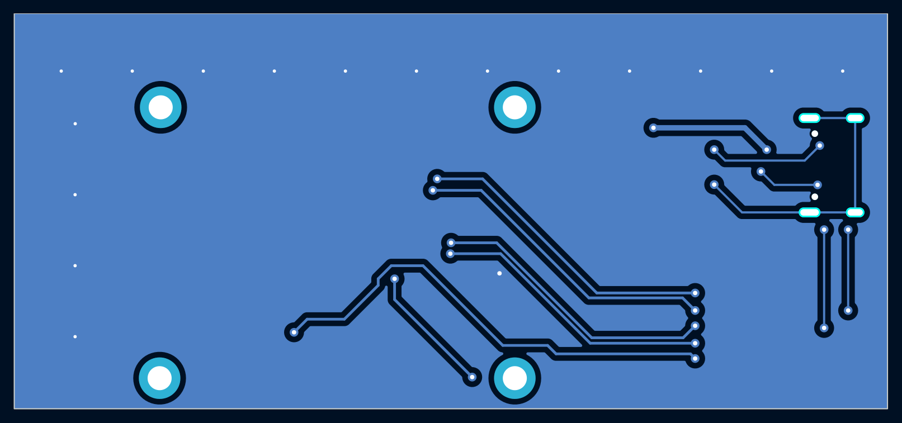

  

# Project Homunculus: Hall Effect VR Glove

The most goated vr glove ever

A hand exoskeleton that reads every finger joint with Hall effect sensors. Each
joint carries a magnet and an SS49E sensor; a custom ESP32-C3 board scans all 16
sensors through a multiplexer and streams the readings over USB serial.

*The glove's kinematic model (23 DOF) being driven in the [visualizer](visualizer/).
Full-quality clip: [`recording_1s-5s.webm`](recording_1s-5s.webm).*

## Layout

| Path | What |
| --- | --- |
| [`firmware.ino`](firmware.ino) | ESP32-C3 firmware: steps the mux through all 16 channels, reads each sensor on the ADC and prints the values over serial at 115200 baud |
| [`homunculus_pcb/`](homunculus_pcb/) | The sensor board: KiCad project, fab-ready gerbers, BOM and pick-and-place file (see [below](#homunculus_pcb)) |
| [`print/`](print/) | 3D-printable parts: full `left_hand.stl` / `right_hand.stl`, the Blender source, and [`individual_stls/`](print/individual_stls/) split per joint (MCP, PIP, DIP, IP, palm) |
| [`model/`](model/) | URDF of the glove (`glove_non_diametric.urdf`, 23 revolute DOF) plus the STL meshes it references, in `meshes/printed/` (per joint: MCP, PIP, DIP, palm), `meshes/hardware/` and `meshes/electronics/` |
| [`visualizer/`](visualizer/) | Interactive viewer for `model/` (meshcat 3D view + one slider per joint) and a URDF validator for Onshape re-exports |
| [`BOM.md`](BOM.md) | Bill of materials: boards, power, screws, bearings |
| [`tutorial.pdf`](tutorial.pdf) | Build tutorial |

## homunculus_pcb

An 80 × 36 mm two-layer board (glove-v4.2). Each of the 16 JST SH 3-pin
connectors (`H0`–`H15`) takes one Hall sensor. They feed a CD74HC4067 16-channel
analog mux (`U3`) that the ESP32-C3-WROOM-02 (`U1`) switches and samples. It's
powered from USB-C (`J1`) through a fuse and an AMS1117-3.3 regulator (`U2`), and
three OPA340 op-amps (`U4`–`U6`) sit in the analog path to the ADC.

| Path | What |
| --- | --- |
| [`homunculus_pcb/gerber.zip`](homunculus_pcb/gerber.zip) | Gerbers + drill files, ready to upload to a fab (e.g. JLCPCB) |
| [`homunculus_pcb/BOM.csv`](homunculus_pcb/BOM.csv) | Component list with LCSC part numbers, for PCB assembly |
| [`homunculus_pcb/POS.csv`](homunculus_pcb/POS.csv) | Pick-and-place positions, for PCB assembly |
| [`homunculus_pcb/kicad/pcb/`](homunculus_pcb/kicad/pcb/) | KiCad project: open `desk_display.kicad_pro` (schematic + layout, custom footprints in `lib/`) |
| [`homunculus_pcb/images/`](homunculus_pcb/images/) | The layer plots above, from `kicad-cli pcb export svg` |
